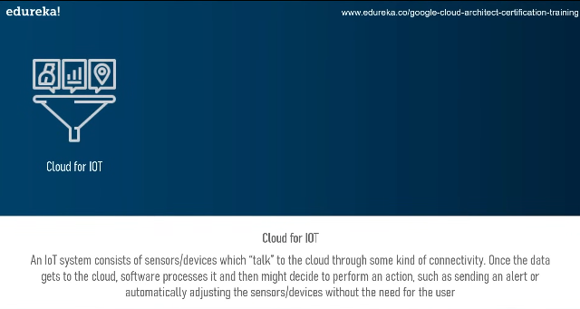
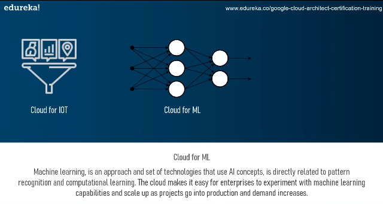

# GCP_Learnings

what is cloud computing?

<!-- ans:  -->

it is the delivery of computing services over the internet including software, applications, databases, and storage.

<!-- cloud sevice providerse -->

<!-- cloud for iot -->

<!-- cloud for ML -->

<!-- how it will use in ml -->
