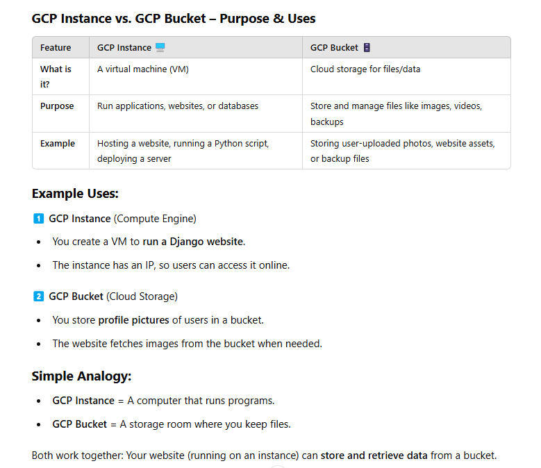
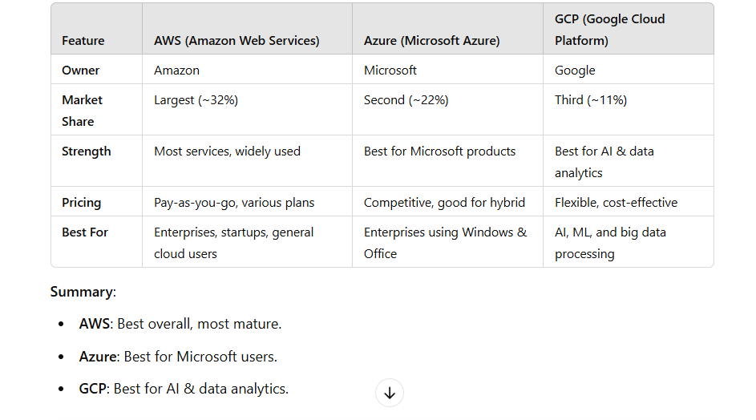
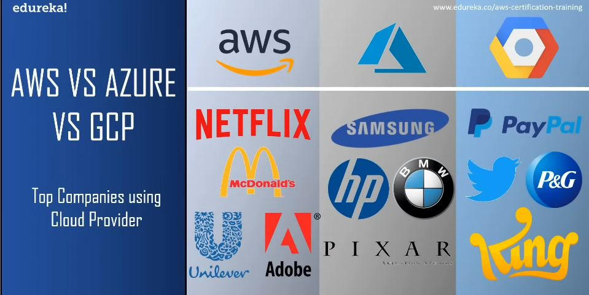
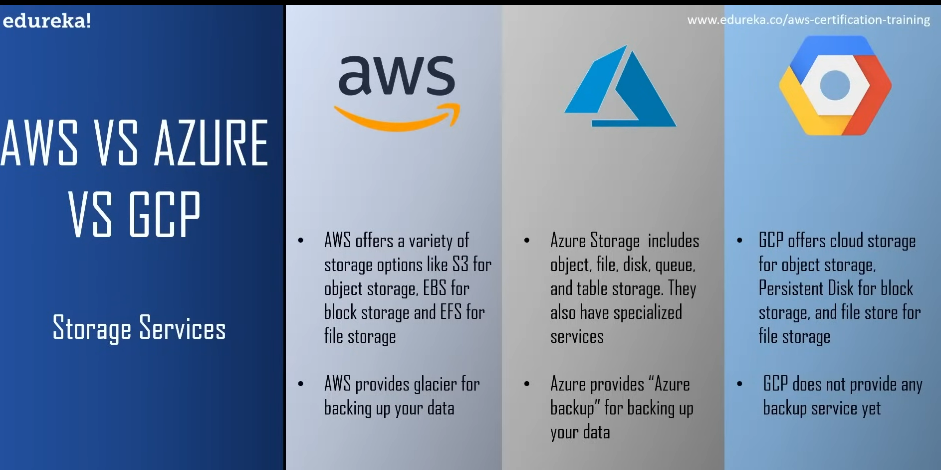
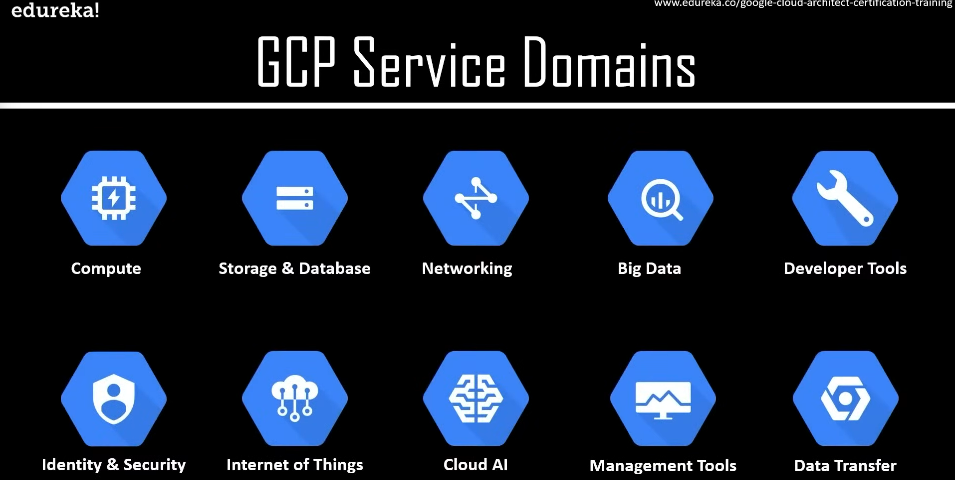

# GCP_Learnings

what is cloud computing?

<!-- ans:  -->

it is the delivery of computing services over the internet including software, applications, databases, and storage.

<!-- cloud sevice providerse -->

<!-- cloud for iot -->

<!-- cloud for ML -->

<!-- how it will use in ml -->

<!-- what is disaster recovery -->

<!-- what is google cloud platform -->
The Google Cloud Platform (GCP) is a suite of cloud services that offers server space on virtual machines, internal networks, VPN connections, disk storage, machine language SaaS (Software as a Service) applications

 <!-- why GCP -->

1. cost effective
2. serverless
3. iot
4. API platforms
5. highly scalable
6. custom machine types

<!--  uses of gcp instance and bucket in gcp -->

<!--AWS vs AZURE vs GCP -->

<!-- TOP Companies using cloud servers -->

<!-- storage services -->

<!-- GCP service domains -->
