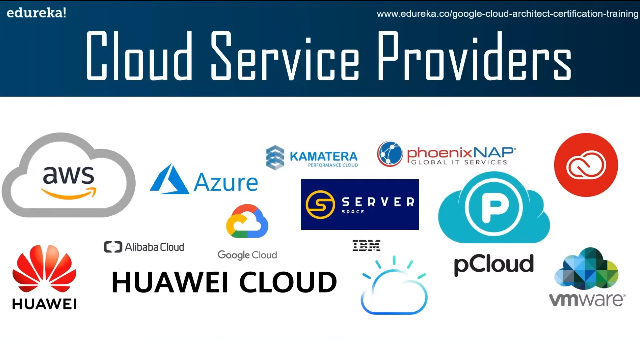
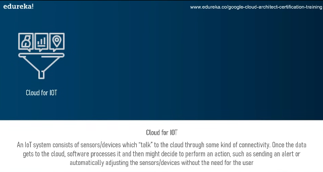
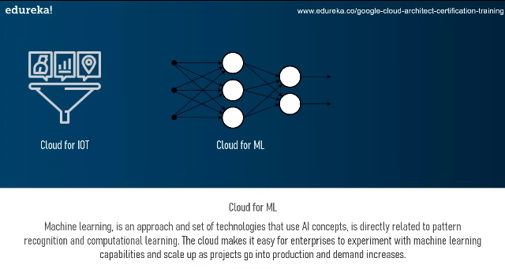
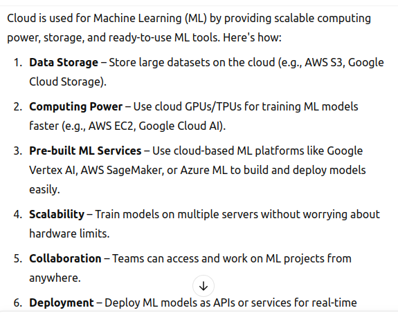
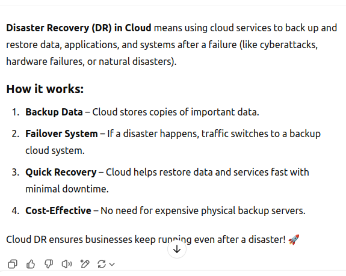

# GCP_Learnings

what is cloud computing?

<!-- ans:  -->

it is the delivery of computing services over the internet including software, applications, databases, and storage.

<!-- cloud sevice providerse -->

<!-- cloud for iot -->

<!-- cloud for ML -->

<!-- how it will use in ml -->

<!-- what is disaster recovery -->

<!-- what is google cloud platform -->
 <!-- why GCP -->

1. codt effective
2. serverless
3. iot
4. api platforms
5. highly scalable
6. custom machine types
